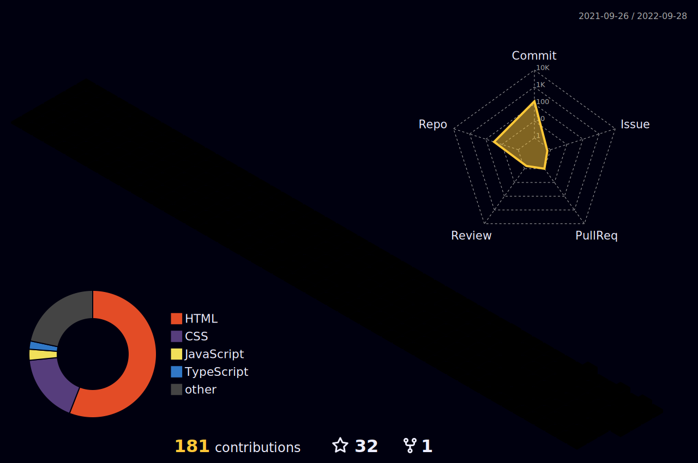

<h1 align="center">Hi 👋, I'm Vandit Bera</h1>
<h3 align="center">A passionate full stack web developer from India</h3>

---

 

- 🌱 I’m currently learning **Full Stack Javascript Web Devloper**

- 👨‍💻 All of my projects are available at [https://github.com/vandit-bera](https://github.com/vandit-bera)

- 📝 I regularly write articles on [https://hashnode.com/@Vandit2510](https://hashnode.com/@Vandit2510)

- 📫 How to reach me **vanditbera@gmail.com**

 

<h3 align="left">Connect with me:</h3>

 

<h3 align="left">Languages and Tools:</h3>

                    

 

 

<h3 align="left">
Watch my contributions graph eaten by snake 🐍
</h3>

---

---

 

<h1 align="center">
YOU DREAM IT. I CREATE IT.
</h1>

 
<h1 align="center">
❤️ I WRITE CODE ❤️
</h1>
